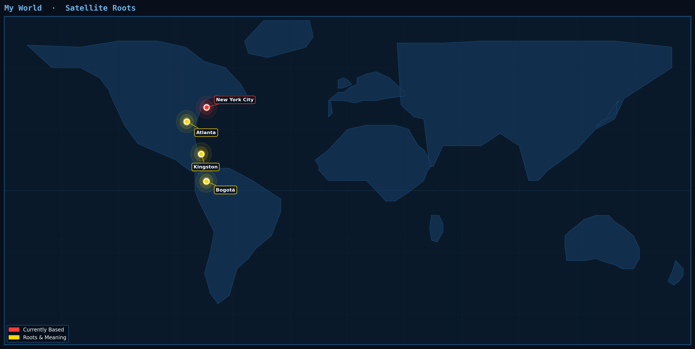

  

<h1 align="center">Hi, I'm Mark Lannaman 🌎🛰️</h1>

  <strong>Geospatial Engineer &nbsp;·&nbsp; Environmental Storyteller &nbsp;·&nbsp; Clean Energy Advocate</strong>

  I transform complex satellite data into interactive tools and compelling visual stories 
  to advance energy equity and sustainable development.

  
  
  

---

### 🛠️ Tech Stack

| Layer | Tools |
|---|---|
| **Geospatial** | Google Earth Engine · QGIS · Remote Sensing · Spatial Data Viz |
| **Programming** | Python (Panel, Pandas, NumPy) · JavaScript (GEE API) |
| **Domains** | Renewable Energy Modeling · Mangrove Monitoring · AgTech (CEA Systems) |

---

### 📡 Professional Impact

**ORISE Fellow** · *U.S. Department of Energy*
> Advancing community-led clean energy transitions and energy equity across underserved communities.

**NASA DEVELOP & Southface Energy Institute**
> Leveraging Earth observations for regional sustainability planning and environmental decision-making.

**NEW Center for AgTech**
> Researching controlled-environment agriculture (CEA) systems and vertical farming innovation.

---

### 🎬 Media & Storytelling

| Role | Project |
|---|---|
| **Documentary Director** | *Atlanta Gentrification* — **2022 Southeast Emmy-nominated** film on urban displacement |
| **Associate Producer** | *1996 Atlanta Olympics Documentary* — Long-form narrative on Atlanta's global legacy |
| **Journalist** | *The Saporta Report* & *NPR Atlanta* — Climate, urbanism & social justice coverage |

---

### 🌍 My World

  

  🔴 New York City &nbsp;·&nbsp; 🟡 Atlanta &nbsp;·&nbsp; 🟡 Kingston &nbsp;·&nbsp; 🟡 Bogotá

---

### 🤝 Let's Collaborate

I'm looking to partner on projects involving:

- 🌱 **Mangrove Remote Sensing** & Blue Carbon sequestration
- ☀️ **Solar PV Modeling** & Microgrid feasibility
- 🌾 **Vertical Farming** & Sustainable food systems

  
  &nbsp;
  

