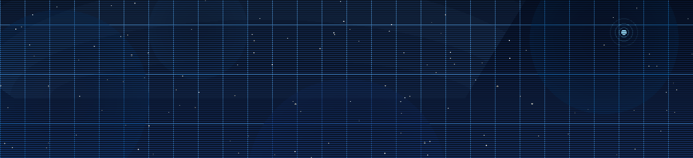

# Hi, I'm Mark Lannaman 🌎🛰️
**Geospatial Data  | Environmental Storyteller | Clean Energy Advocate**

I transform complex satellite data into interactive tools and compelling visual stories to advance energy equity and sustainable development.

---

### Tech Stack
* **Geospatial:** Google Earth Engine (GEE), QGIS, Remote Sensing, Spatial Data Viz.
* **Programming:** Python (Panel, pandas, numpy, geemap, leafmap); JavaScript (GEE).
* **Domains:** Renewable Energy Microgrids (solar), Environmental Monitoring, AgTech (CEA Systems).

---

### Professional Impact
* **ORISE Fellow** | *U.S. Department of Energy (DOE)*: Advancing community-led clean energy transitions and equity.
* **NASA DEVELOP**: Leveraged Earth observations for regional sustainability.
* **NEW Center for AgTech**: Researched controlled-environment agriculture (CEA) systems.

---

### Media & Storytelling
* **Documentary Director** | *Atlanta Gentrification*: Directed a **2022 Southeast Emmy-nominated** film on urban change.
* **Associate Producer** | *1996 Atlanta Olympics Documentary*: Producing long-form narratives on Atlanta’s global legacy.
* **Journalist** | *The Saporta Report* & *NPR Atlanta*: Covering climate, urbanism, and social justice.

---

### More About Me
* **Heritage:** Born and raised in Atlanta; Jamaican and Colombian descent.
* **Loyalty:** Die-hard **New York Knicks** fan. If I can stick with them through a 17-win season, I can see any project through to the finish line.

---

**[Message me on LinkedIn](https://www.linkedin.com/in/mark-lannaman-177551184/) to talk! **
